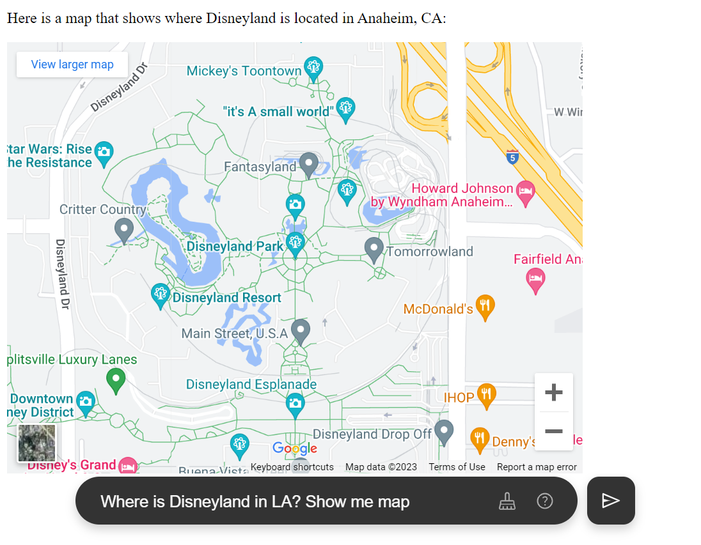
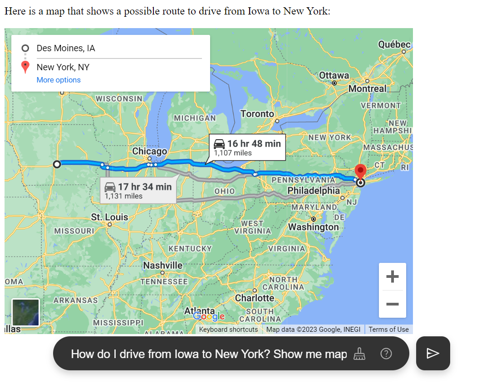
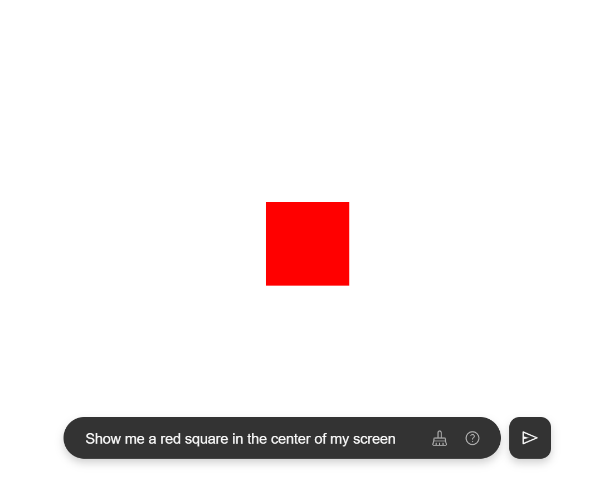
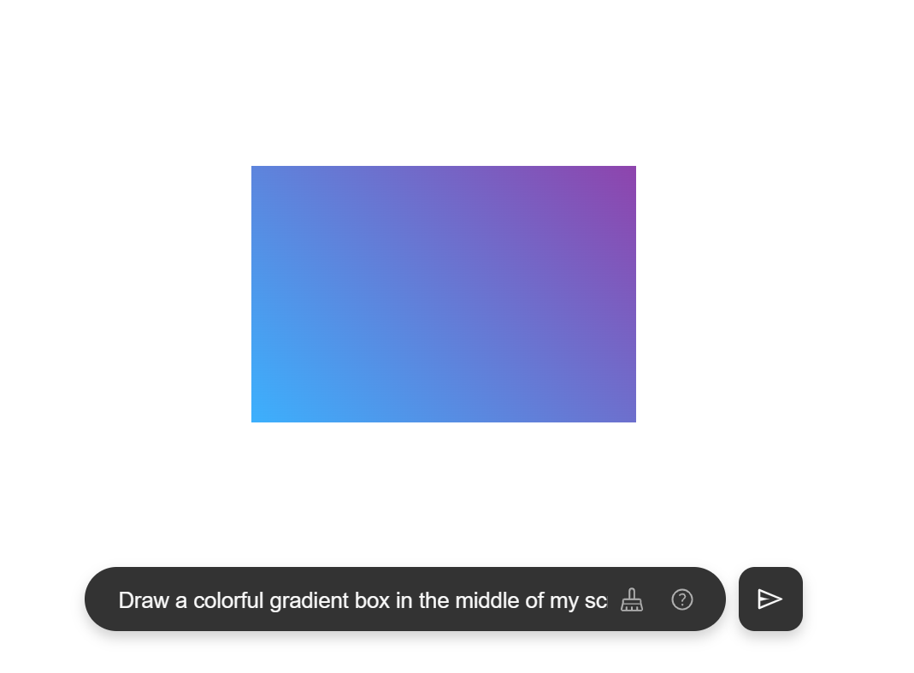
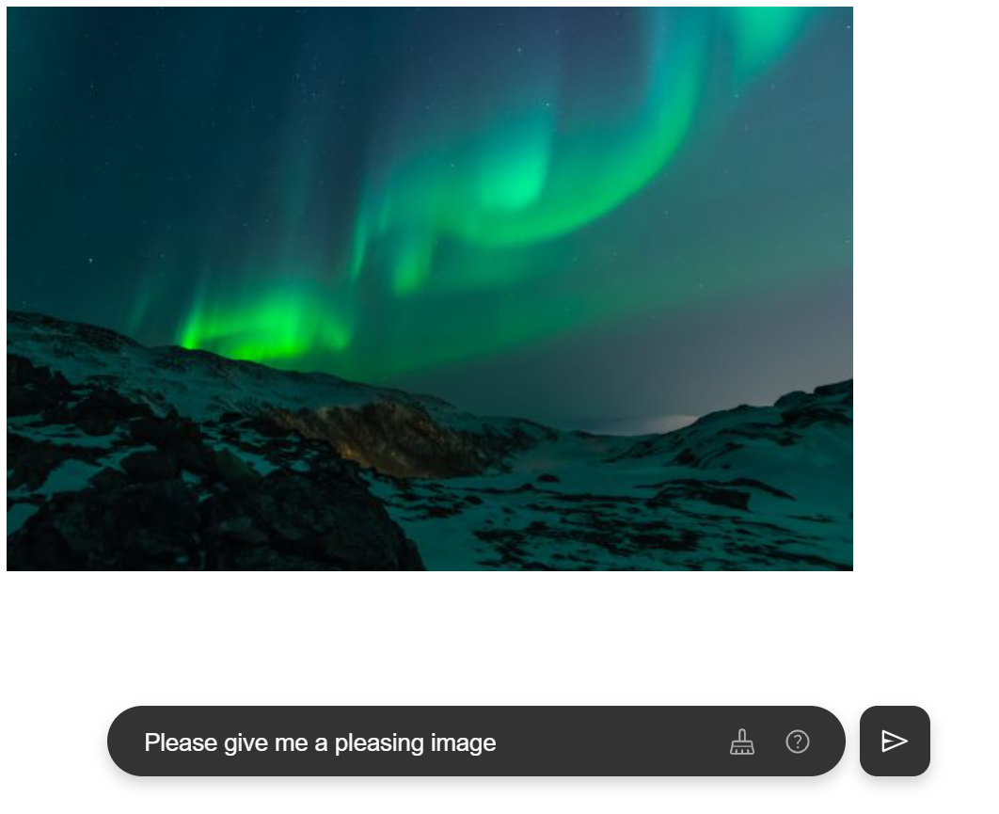
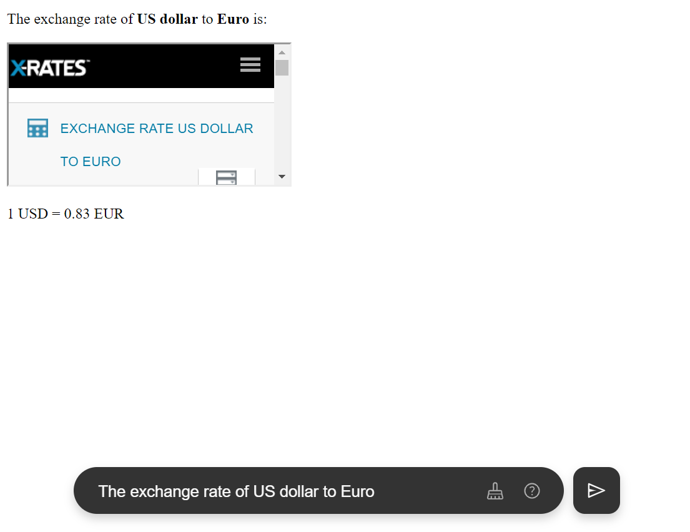
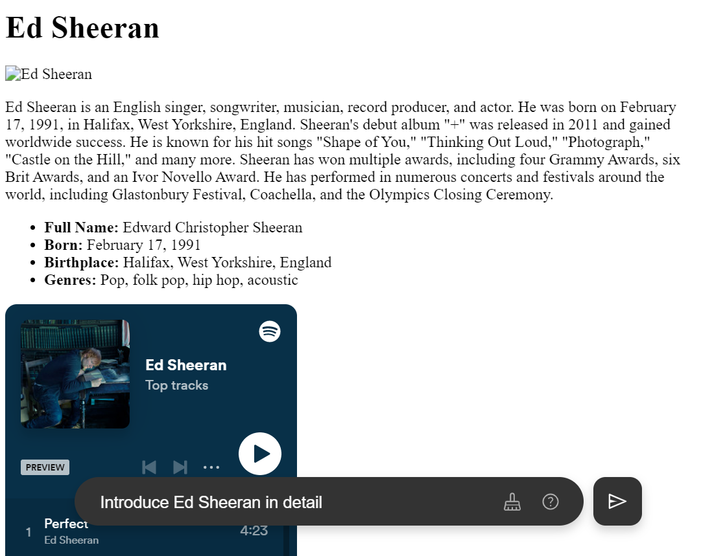
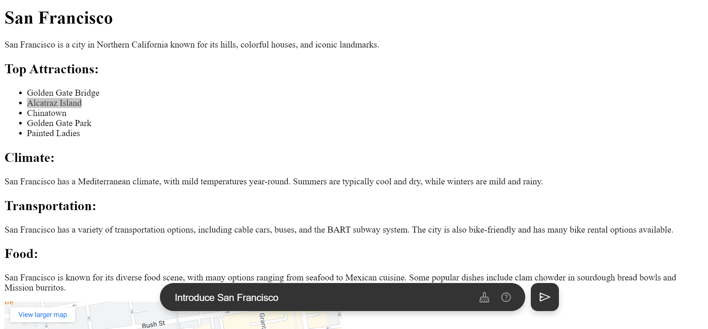

# visualized-gpt

English | [中文](./README_zh.md)

> Perhaps many years from now, people will look back at the year 2023 and wonder why so many individuals were akin to monkeys, shouting at screens with great excitement.

## Use Instantly

Select one of the following urls to experience it!

https://visualized-gpt.zeabur.app/

https://visualized-gpt.vercel.app/

https://visualized-gpt.netlify.app/

## Principle

Let ChatGPT return the text in HTML format, and then put it all into `<iframe />`. It's just that simple.

## Deployment on your own

Please see [Deploying visualized-gpt on your own](./docs/deployment.md)

## LICENSE

MIT
