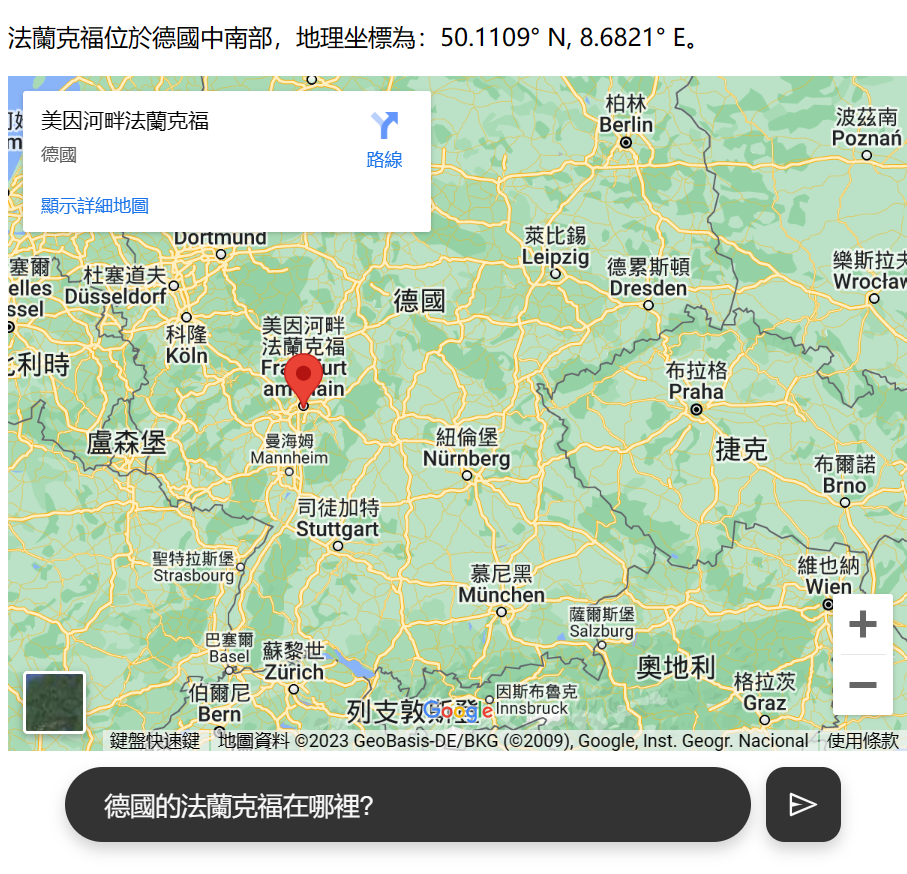
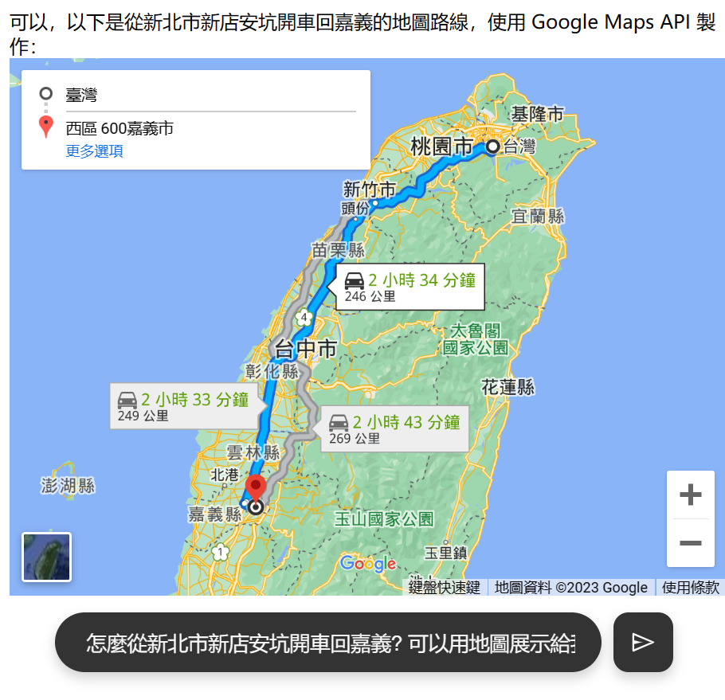
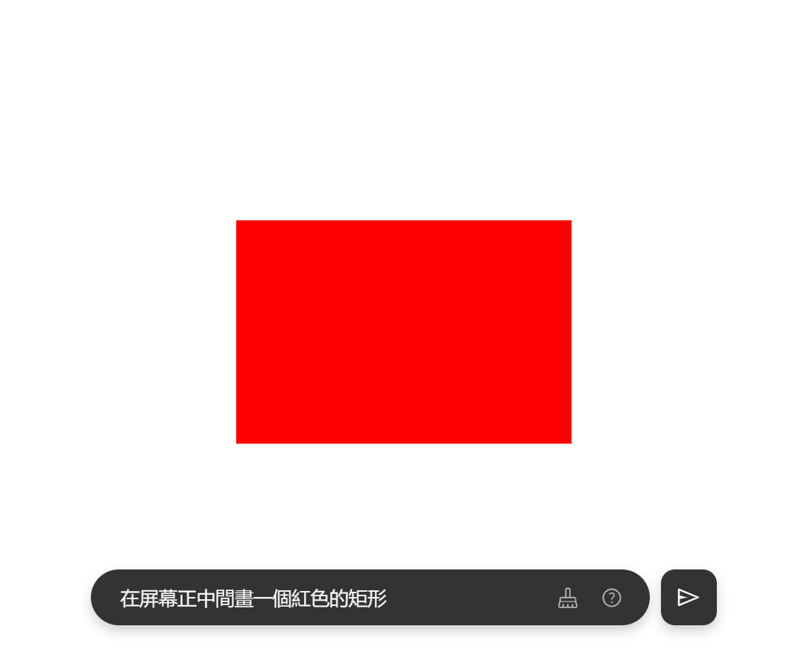
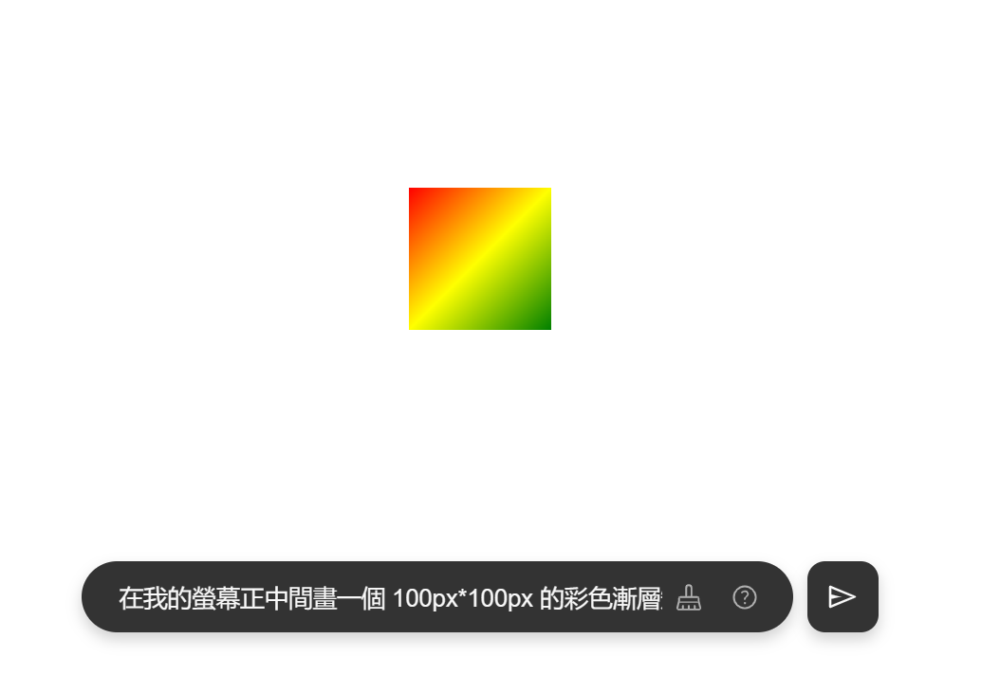
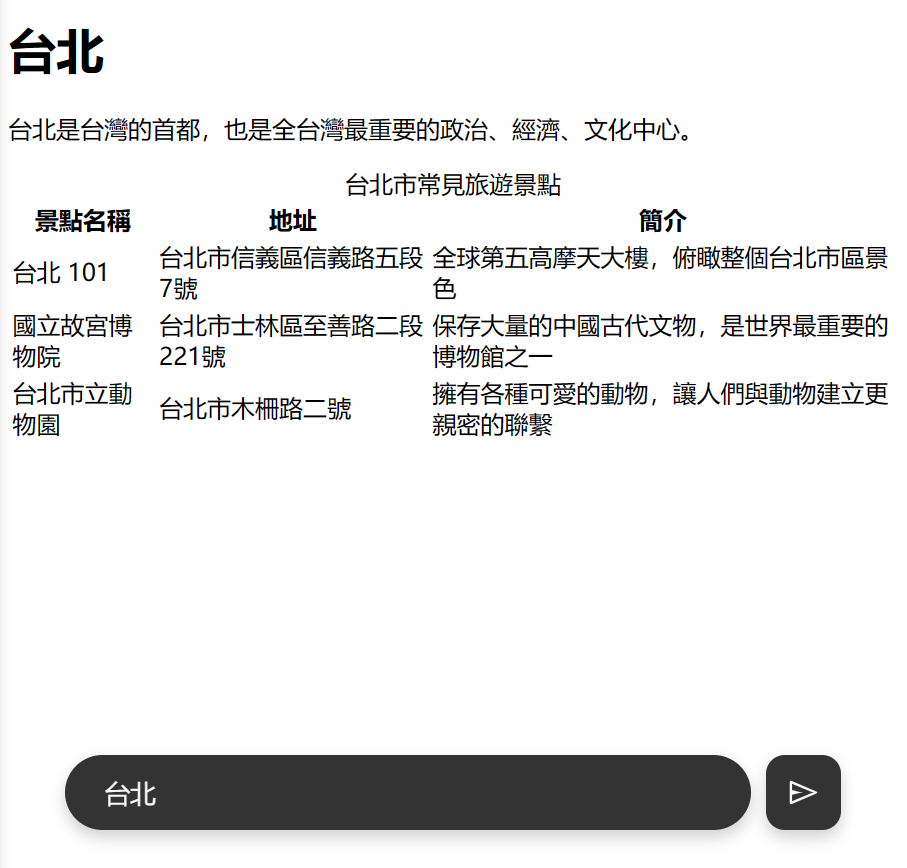
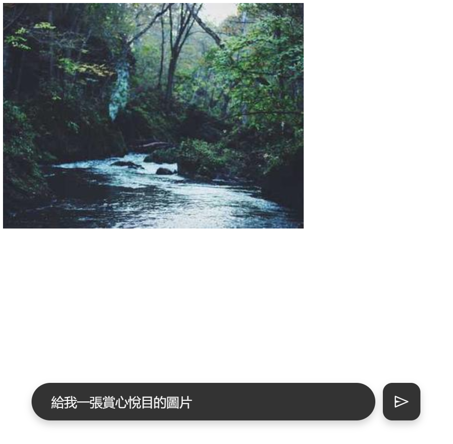
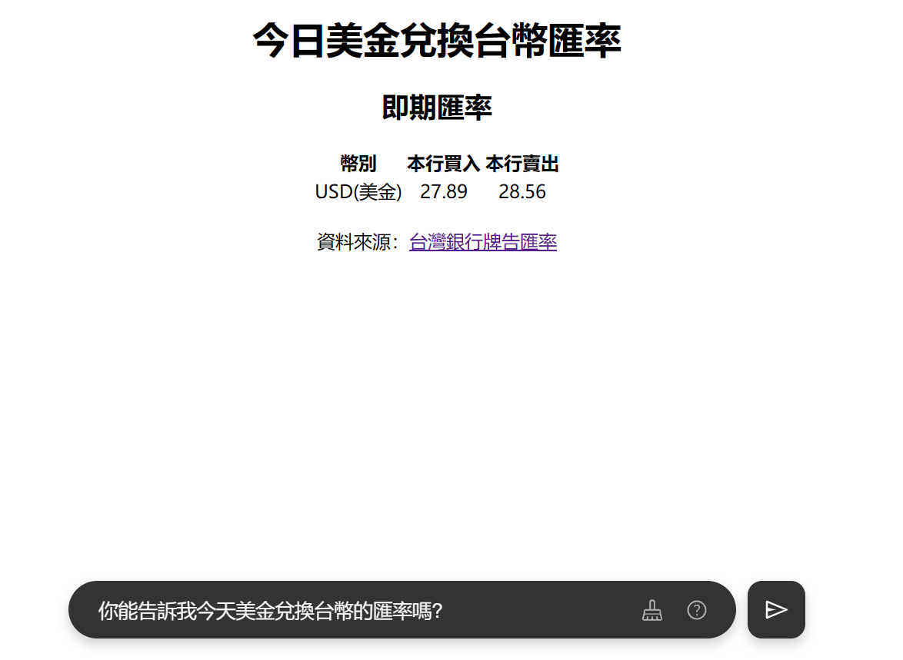
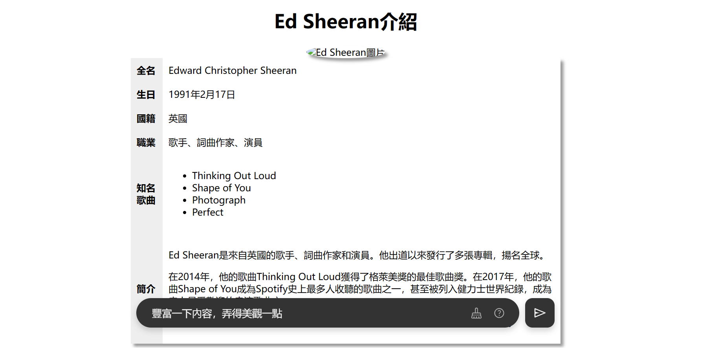

# visualized-gpt

> 也許很多年後，人類回望 2023 年，只會覺得那時的人們是多麼地像猴子，竟然在對一個螢幕大吼大叫、興奮不已。

## 體驗

TODO

## 原理

讓 ChatGPT 回傳 HTML 格式的文本，再把這段文本全部丟進 `<iframe />` 裡。就這麼簡單。

## 自行部署

參見 [自行部署](./docs/deployment_zh.md)

## LICENSE

MIT