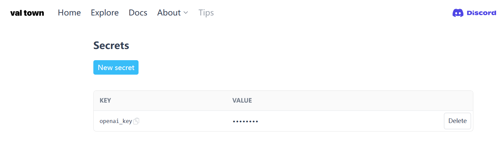

# Deploying visualized-gpt on your own

### 1. Download the code

```bash
git clone git@github.com:yenche123/visualized-gpt.git
cd visualized-gpt
```

### 2. Install dependencies

```bash
# Please make sure you have pnpm installed beforehand
pnpm i
```

### 3. val town

Open [Val Town](https://www.val.town/) and log in. When logging in, please remember the username you entered on the following page.


After logging in, go to the [Secrets Page](https://www.val.town/settings/secrets)，and enter your `openai_key` as shown below.



The KEY name is `openai_key`, and the VALUE can be obtained from [OpenAI Api Keys](https://platform.openai.com/account/api-keys)

### 4. Copy cloud function

Open [cloud function](https://www.val.town/yenche.visualizedGpt), tap the `Fork` button, and then press `Run`, as shown below.

// Image to be added

### 5. Configure environment variables

Go back to the project root directory and create a new file named `.env.local.` Copy all the text in `.env.template` to `.env.local` and fill in the corresponding values for each environment variable after `=`, as shown below.

```properties
# your username in val town
VITE_VAL_TOWN_USERNAME=Your val town username should be filled in here
```

### 6. Preview

```bash
pnpm run dev
```

After waiting for vite to process, press the `o` key to preview.

### 7. Build

```bash
pnpm run build
```

After waiting for vite to process, you can get the `./dist` folder in the project root directory, where the files are the production code for the front-end.

### 8. Deployment

Put the files in `./dist` into your own server, or use a third-party static website hosting service such as [Zeabur](https://zeabur.com/) / [Netlify](https://www.netlify.com/) / [Cloudflare](https://www.cloudflare.com/zh-tw/) / [Vercel](https://vercel.com/)

Congratulations, you are done! 🎉

