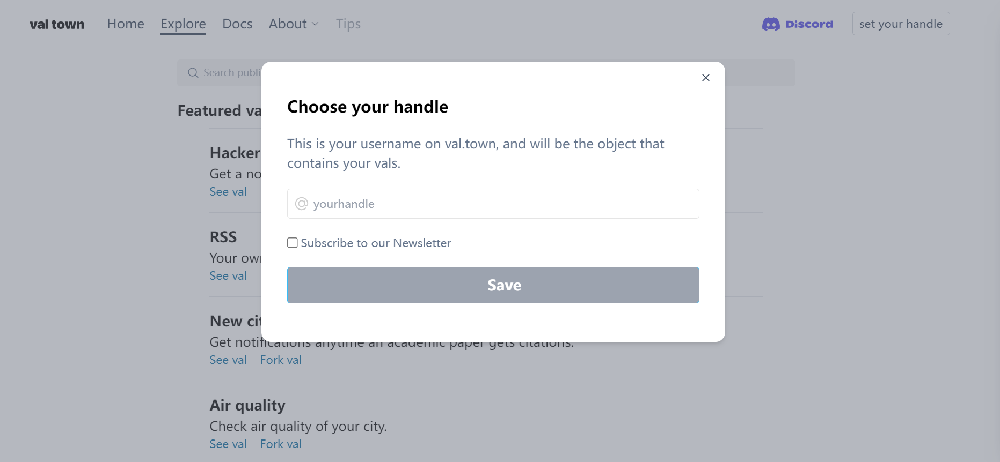
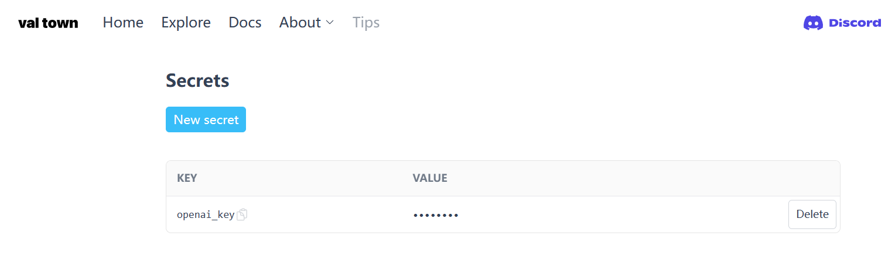

# 自行部署 visualized-gpt

### 1. 下載程式碼

```bash
git clone git@github.com:yenche123/visualized-gpt.git
cd visualized-gpt
```

### 2. 安裝依賴

```bash
# 請事先安裝好 pnpm
pnpm i
```

### 3. val town

打開 [Val Town](https://www.val.town/) 並登入；登入時，請記住你在 val town 如下頁面時輸入的 username。



登入後，於 [Secrets 頁面](https://www.val.town/settings/secrets)，填入你的 `openai_key`，如下圖所示



其中 KEY 命名為: `openai_key`，VALUE 從 [OpenAI Api Keys](https://platform.openai.com/account/api-keys) 中獲取。

### 4. 複製後端雲函式

打開 [雲函式](https://www.val.town/yenche.visualizedGpt)，輕觸 `Fork` 按鈕，再按 `Run`，如下圖所示。

// 待添加圖片

### 5. 配置環境變量

回到專案根目錄，新建一個 `.env.local` 的文件，複製 `.env.template` 裡的所有文字到 `.env.local`，再於每個環境變量 `=` 後面填入對應的值，如下所示

```properties
# your username in val town
VITE_VAL_TOWN_USERNAME=你的val town username請在這裡填入
```

### 6. 預覽

```bash
pnpm run dev
```

等待 vite 處理後，再按 `o` 鍵，即可預覽。

### 7. 打包

```bash
pnpm run build
```

等待 vite 處理後，即可在專案根目錄中，獲得 `./dist` 文件夾，當中的文件即是前端生產環境的程式碼。

### 8. 部署

將 `./dist` 中的文件放進自己的伺服器中，或者使用第三方靜態網站託管服務，比如 [Zeabur](https://zeabur.com/) / [Netlify](https://www.netlify.com/) / [Cloudflare](https://www.cloudflare.com/zh-tw/) / [Vercel](https://vercel.com/)

如此即大功告成🎉